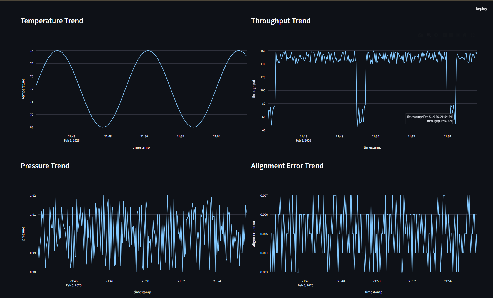
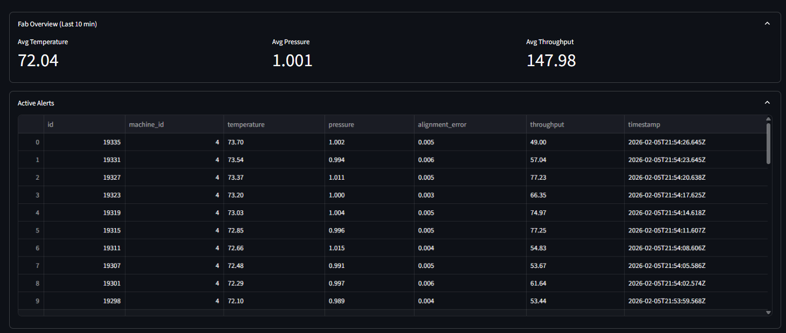
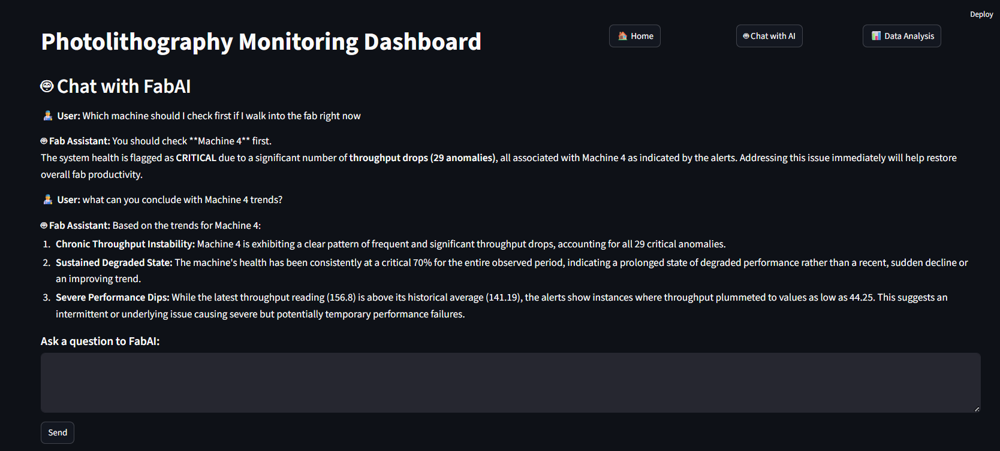
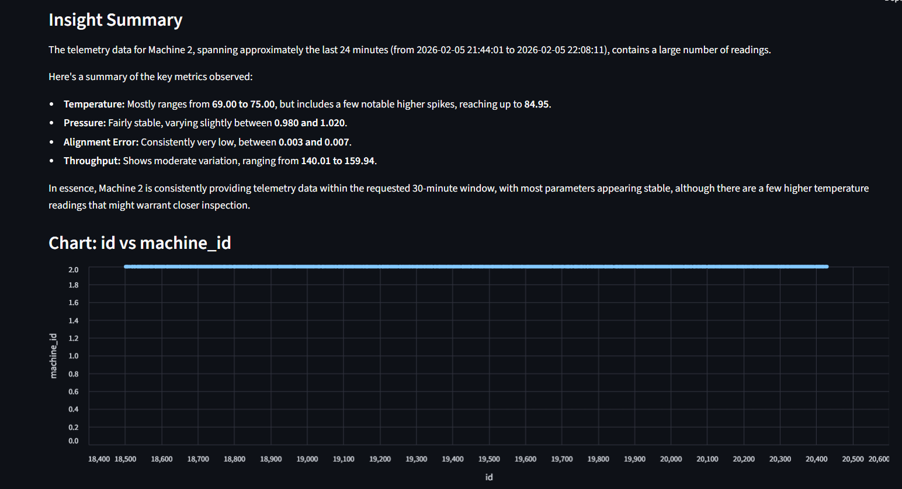

# 📡 Photolithography Monitoring Dashboard  
### Real‑time equipment monitoring, anomaly detection, and AI‑powered analytics

This project is a **locally runnable, production‑grade monitoring and analytics platform** that simulates a real semiconductor photolithography equipment dashboard. It combines:

- A **Node.js + Express backend**
- A **PostgreSQL database**
- A **synthetic telemetry generator**
- A **Streamlit dashboard with a modern 3‑page UI**
- A **hybrid anomaly detection engine**
- A **machine health scoring system**
- A **GenAI-powered conversational assistant**
- A **Natural‑Language‑to‑SQL analytics engine**

The system continuously ingests synthetic telemetry, computes machine health in real time, and provides interactive visualizations, alerts, and AI‑driven insights.

---

# 🚀 Features

## **1. Real‑time Telemetry**
Each machine streams live telemetry every second:

- Temperature  
- Pressure  
- Alignment error  
- Throughput  

All data is stored in PostgreSQL and visualized instantly.

---

## **2. Hybrid Anomaly Detection**
The backend uses a multi‑layer anomaly engine:

- Raw threshold checks  
- Z‑score statistical deviation  
- Drift detection  
- Worst‑case severity logic  

This produces realistic fab‑style alerts and severity flags.

---

## **3. Machine Health Scoring**
Each machine receives a dynamic health score (0–100) based on:

- Recent anomalies  
- Statistical deviations  
- Trend behavior  
- Severity weighting  

Severity levels:

- 🟩 HEALTHY  
- 🟨 MINOR  
- 🟧 MAJOR  
- 🟥 CRITICAL  

---

## **4. Modern 3‑Page Streamlit Dashboard**

### **Page 1 — Home (Monitoring Dashboard)**
- Machine status  
- Latest telemetry  
- Health score + severity badge  
- Anomaly counters  
- Active flags  
- Health trend  
- 2×2 telemetry graph grid  
- Fab‑level overview  
- Recent alerts table  

📸 **Project Screenshots (Page 1):**  
1.   
2.   
3.   

---

### **Page 2 — Ask the Fab (Conversational AI Assistant)**
A GenAI‑powered assistant that understands:

- Equipment behavior  
- Anomalies  
- Trends  
- Follow‑up questions (conversation memory)  
- Context from telemetry + alerts + health  

Example questions:

- “Why did Machine 2’s health drop?”  
- “Was it mainly temperature or throughput?”  
- “Show me only the last 10 minutes.”  

📸 **Project Screenshots (Page 2):**  
4.   

---

### **Page 3 — NL → SQL Explorer**
A natural‑language analytics engine that:

- Converts English questions into SQL  
- Executes the query on PostgreSQL  
- Returns results + charts + summaries  

Example questions:

- “Show me the last 10 telemetry rows.”  
- “Which machine has the highest average throughput?”  
- “List all pressure readings below 0.95.”  

📸 **Project Screenshots (Page 3):**  
5.   
6.   

---

# 🧱 Architecture Overview

```
┌──────────────────────────┐
│   Synthetic Data Engine   │
│  (Node.js, cron-based)    │
└──────────────┬───────────┘
               │ inserts
               ▼
┌──────────────────────────┐
│       PostgreSQL DB       │
│  telemetry + machines     │
└──────────────┬───────────┘
               │ queries
               ▼
┌──────────────────────────┐
│  Backend API (Express)    │
│  /latest /timeline /health│
│  /overview /alerts        │
│  /analysis /query         │
└──────────────┬───────────┘
               │ JSON
               ▼
┌──────────────────────────┐
│   Streamlit Dashboard     │
│   3‑page modern UI        │
│   Real‑time visualization │
│   GenAI insights          │
└──────────────────────────┘
```

---

# 📦 Tech Stack

## **Backend**
- Node.js  
- Express  
- PostgreSQL  
- pg (Postgres client)  
- Cron‑based cleanup  
- Gemini 2.5 Flash (GenAI)  

## **Frontend**
- Streamlit  
- Plotly  
- Altair  
- Pandas  

## **Infrastructure**
- Local PostgreSQL instance  
- Optional Docker setup  

---

# 🗄 Database Schema

## **machines**
| column | type |
|--------|------|
| id | integer |
| name | text |
| status | text |

## **telemetry**
| column | type |
|--------|------|
| id | integer |
| machine_id | integer |
| timestamp | timestamptz |
| temperature | float |
| pressure | float |
| alignment_error | float |
| throughput | float |

---

# ⚙️ Setup Instructions

## **1. Clone the repository**
```
git clone <your-repo-url>
cd photolithography-dashboard
```

## **2. Install backend dependencies**
```
cd backend
npm install
```

## **3. Start PostgreSQL**
Create a database:
```
photolithography
```

Run schema SQL (tables + seed machines).

## **4. Start the backend**
```
npm run dev
```

Backend runs at:
```
http://localhost:4000
```

## **5. Install dashboard dependencies**
```
cd ../frontend
pip install -r requirements.txt
```

## **6. Run the dashboard**
```
streamlit run dashboard.py
```

Dashboard runs at:
```
http://localhost:8501
```

---

# 🧹 Automatic Cleanup (50k rows per machine)

A scheduled cleanup job:

- Runs every 10 minutes  
- Keeps only the **latest 50,000 rows per machine**  
- Prevents database growth  
- Keeps storage under ~20–30 MB  

Cleanup logic lives in:

```
src/services/cleanup.service.ts
```

---

# 📊 Screenshots

### **Page 1 — Home**
1. Machine health + anomalies  
2. Telemetry graphs  
3. Alerts table  

### **Page 2 — Ask the Fab**
4. Chat interface  

### **Page 3 — NL → SQL**
5. Query interface  
6. Insight summary  

---

# 🧪 Testing

You can test the system by:

- Modifying synthetic data generation  
- Triggering anomalies  
- Observing severity changes  
- Watching alerts populate  
- Running NL→SQL queries  
- Asking follow‑up questions in the chatbot  

---

# 📝 Future Enhancements

- Fab‑level heatmap  
- Predictive maintenance model  
- WebSocket live updates  
- Multi‑fab support  
- Machine comparison mode  
- Daily fab report generator  

---

# 👤 Author

**Atharva Pargaonkar**  